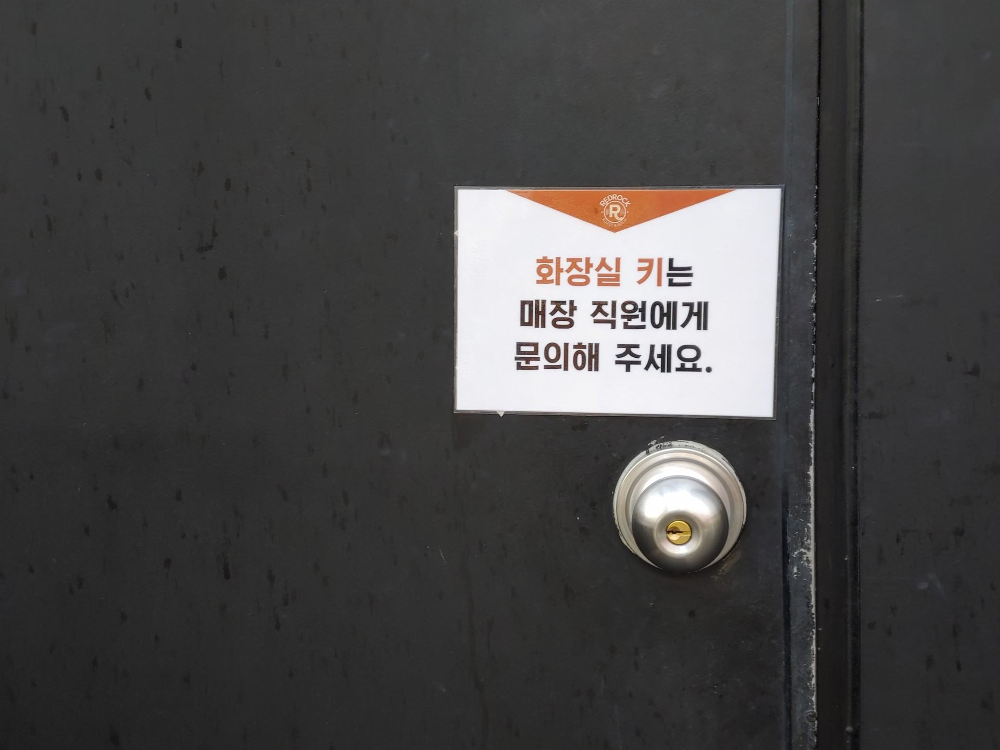
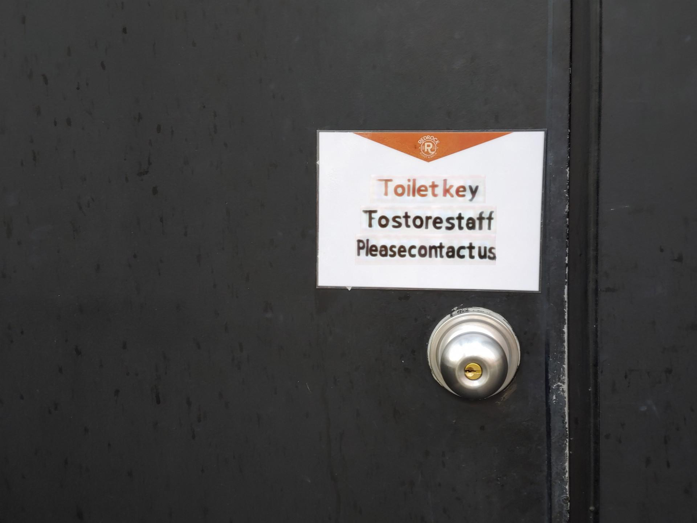

# Style-Preserving Image Translation from Korean to English

=======
KAIST 2020Fall CS470 Introduction to Artificial Intelligence

Authorized [Yeongho Jeong](https://github.com/jyeongho)

Authorized [DonghwanKim](https://github.com/DonghwanKIM0101)

Authorized [Seeha Lee](https://github.com/ee12ha0220)

Authorized [SeungilLee](https://github.com/ChoiIseungil)

-----------

## Introduction
The unique style of the text is an important element of graphic design. The color, font, and texture of each text convey information to the reader. There are well-known translator mobile applications that are capable of doing this; Google translator and Naver Papago for example. But these translators cannot preserve the style of the text at all. This project aims to translate text in the wild, while preserving original text style, especially from Korean to English.

<<Style-Preserving Image Translation from Korean to English(리포트 주소)>>

# Usage

We used Google Colab for training and predicting.
[SRNet.ipynb](https://github.com/DonghwanKIM0101/CS470_Team6/blob/main/SRNet.ipynb) is for training SRNet with Korean dataset,
[Kor_ocr_translation.ipynb](https://github.com/DonghwanKIM0101/CS470_Team6/blob/main/Kor_ocr_translation.ipynb) is for predicting final results.

* Clone this repository(in Google Colab):

        import os
        from google.colab import drive

        if not os.path.exists('/content/drive'):
                drive.mount('content/drive')
        
        %cd /content/drive/My Drive
        !git clone https://github.com/DonghwanKIM0101/CS470_Team6.git
        
        %cd CS470_Team6

* Prepare Google Transalation key

[Google Cloud](https://cloud.google.com/translate)

and edit the path of translation key in [Kor_ocr_translation.ipynb](https://github.com/DonghwanKIM0101/CS470_Team6/blob/main/Kor_ocr_translation.ipynb)

* If Google Colab print error message "RESTART RUNTIME", just restart runtime solve the error.

## Train

Original [SRNet](https://github.com/Niwhskal/SRNet) edit text from English to English, but our model need a style conversion model from Korean to English.
We prepare English text dataset and Korean text dataset.
You have to check the path in (https://github.com/DonghwanKIM0101/CS470_Team6/blob/main/SRNet/cfg.py#L25), (https://github.com/DonghwanKIM0101/CS470_Team6/blob/main/SRNet/cfg.py#L30), and some other pathes in ipynb file.
After run all cells in [SRNet.ipynb](https://github.com/DonghwanKIM0101/CS470_Team6/blob/main/SRNet.ipynb), train dataset is generated in (https://github.com/DonghwanKIM0101/CS470_Team6/tree/main/SRNet/datasets), and trained model is generated in (https://github.com/DonghwanKIM0101/CS470_Team6/tree/main/SRNet/logs).

Or, you can just use our pretrained model, [train_step-30000.model](https://drive.google.com/file/d/1LY3nfKSK9sk5Jxrj9GglReC-dzGCuLCH/view?usp=sharing). 

## Predict

In [source](https://github.com/DonghwanKIM0101/CS470_Team6/tree/main/scene_text_test/test_image), put the source image that contain Korean texts , and run all cells in [Kor_ocr_translation.ipynb](https://github.com/DonghwanKIM0101/CS470_Team6/blob/main/Kor_ocr_translation.ipynb). The outputs are generated in [result](https://github.com/DonghwanKIM0101/CS470_Team6/tree/main/scene_text_test/result_image).

## Results
</img>
</img> 

</img>
</img> 

</img>
</img> 

## References
* [SynthText](https://github.com/ankush-me/SynthText): Used to synthesize background image and text to generate train dataset

* [EasyOCR](https://github.com/JaidedAI/EasyOCR): Recoginze Korean text and its bounding box in the image 

* [SRNet](https://github.com/Niwhskal/SRNet): The twin discriminator generative adversarial network that can edit text in any image while maintaining context of the background, font style and color

* [Google Clound Translation](https://cloud.google.com/translate/?hl=ko) : API to translate Korean to English
